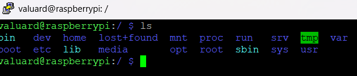
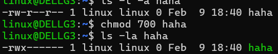

# Lý thuyết về linux

*Trần Hải Đăng CTVBCM EHC*

## MỤC LỤC :

   - [1. File và cấu trúc file trong Linux](#1-file-và-cấu-trúc-file-trong-linux)

   - [2. Tiến trình của chương trình trên linux ](#2-tiến-trình-của-chương-trình-trên-linux)

   - [3. User và group trong Linux ](#3-user-và-group-trong-linux)

   - [4. Phân quyền trong hệ thống Linux ](#4-phân-quyền-trong-hệ-thống-linux)

## 1. File và cấu trúc file trong linux 

### a) File là gì? File được tổ chức như thế nào trong linux?

   - Trong ngữ cảnh máy tính, file được hiểu là một tập hợp các thông tin, cho phép người dùng lưu trữ dữ liệu một cách đơn giản.

   - Trong linux, file được tổ chức theo kiểu cây thư mục, nghĩa là tất cả các file, thư mục thuộc hệ thống đều nằm trong một nút gốc (root)

   - Ta có thể dùng các lệnh trên terminal linux ví dụ như **ls**, **ls -l** ( nếu muốn cụ thể hơn) để liệt kê các file.

   - Linux có nhiều loại file, bao gồm **file thường**, **thư mục**, **file thiết bị**, **file liên kết**, **socket file** và **pipe file**.

### b) Cấu trúc file trong linux :

   Thư mục gốc trong linux là **root**, thường được hiển thị với duy nhất kí tự **/**, từ thư mục này nó sẽ phân nhánh thành nhiều thư mục con khác, thường sẽ như hình minh họa  : 

   *PS:* ***Cùng là linux thì phần lớn sẽ không khác nhau mấy, dưới đây là của rasberry pi 4 model b, trong bài sẽ có những chỗ dùng cả wsl, em xin phép không dùng vm trong write up này vì đợi nó start được thì em đã ăn xong 2 gói mì, quá tốn thời gian -.- )***

   

   - Các thư mục con trong **/** thường bao gồm :

   **/bin** : Chứa các lệnh hệ thống cơ bản

   **/root** : Thư mục riêng của root user

   **/boot** : Chứa file khởi động hệ điều hành ( bootloader hoặc kernel )

   **/etc** : Chứa file cấu hình hệ thống 

   **/dev** : Chứa file thiết bị ( ví dụ ổ USB : **/dev/sdb**).

   **/home** : cd /home/< tên user >, đây là thư mục chứa user data 

   **/mnt** ( hoặc **/media** hoặc cả 2 :v ): Thư mục gắn kết ổ đĩa 

   **/lib** : Thư mục chứa thư viện hệ thống ( giống System32 trên Ưindows )

   **/opt** : Dùng để cài đặt các phần mềm ngoài ( VD cài chrome trên linux là cài phần mềm ngoài )

   **/proc** : Thông tin về tiến trình 

   **/sbin** : Chứa lệnh hệ thống cho **root**

   **/srv** : Dữ liệu cho web, server,...

   **/tmp** : Chứa file tạmp thời

   **/usr** : Chứa phần mềm, thư viện cho user

   **/var** : Chứa cache data, log data,... ( nói chung là dữ liệu thay đổi thường xuyên )

   - Trên hình còn có một số thư mục như **/lost+found**, **/sys**,... các thư viện này phục vụ mục đích khác nhau, như **/lost+found** check lại thiết bị khi ăn crash, check lỗi tập tin ; **/sys** chứa thông tin phần cứng, giao tiếp kernel,... ( Đoạn này lấy từ ChatGPT )

## 2. Tiến trình của chương trình trên linux 

### a) Tiến trình ( process ) là gì? 

   - Tiến trình nghĩa là một chương trình đang chạy trên os.

   VD : Ta phát nhạc bằng file **.mp3**, thì cái ta sử dụng để chạy file **.mp3** là một **chương trình**, khi ta chạy file **.mp3** thì cái mà đang sử dụng tài nguyên máy tính sẽ là **tiến trình**.

   - Tiến trình trong linux được định danh bằng Process ID ( PID )

   - Một process sẽ có lượng bộ nhớ được cấp phát chia làm nhiều phần khác nhau gọi là **segment** ( phân đoạn vùng nhớ )

   Process chia làm 2 loại : 

   #### +> Foreground Process :

   - Tiến trình loại này nhận input từ bàn phím và cho ra output ở màn hình.

   - Không thể chạy một foreground process khác cho đến khi process cũ end hoặc bị kill.

   #### +> Background Process :

   - Tiến trình chạy mà không kết nối với thiết bị input ( trừ khi bản thân nó có yêu cầu kết nối ). 

   - Có thể bắt đầu trước khi background process khác end.

   #### +> Quản lí background process :

   - Để bắt đầu một background process chỉ cần thêm kí tự **&** vào cuối lệnh. Vd : **ping 8.8.8.8 &**

   - Có thể dùng jobs để liệt kê các background process, ví dụ như trong ảnh :

   

   Có thể thay đổi 

### b) Xem, quản lí, kill process :

   #### b1) Xem process, quản lí process : 

   Chúng ta có thể dùng lệnh **ps aux** và **top** trên terminal để hiển thị danh sách các process, tuy nhiên để nhìn cho đẹp thì nên dùng **htop**, tuy nhiên phải tải vể bằng lệnh **apt install htop**. Sau khi dùng lệnh **htop**, ta có một bảng các process giống như các hình :

   

   

   #### b2) Kill process ( Dừng tiến trình, ngắt tiến trình ):

   Có thể dừng / tắt process bằng các lệnh như **kill < PID >**, nếu không được, try **kill -s 9 < PID >**; hoặc có thể tắt toàn bộ các tiến trình có một loại tên giống nhau bằng cách dùng lệnh **killall -s 9 < target name >** hoặc **pkill -s 9 < target name >** :v

## 3. User và group trong linux 

   - **User** và **group**, tiếng Anh lần lượt có nghĩa là **người dùng** và **nhóm**. 

   - Trong hệ thống Linux, **user** là tài khoản cá nhân với tên và mật khẩu đăng nhập riêng biệt, được chia thành 2 loại là **super user** và **regular user**. Mỗi user cũng được định danh riêng bằng **UID** ( Tài liệu tham khảo : https://vietnix.vn/uid-la-gi/#:~:text=UID%20l%C3%A0%20m%E1%BB%99t%20d%C3%A3y%20s%E1%BB%91,d%C3%A2n%20m%C3%A0%20b%E1%BA%A1n%20%C4%91%C6%B0%E1%BB%A3c%20c%E1%BA%A5p. ).

   - **Group** ( được định danh bằng **GID** ), như tên của nó, là tập hợp một hoặc nhiều **user** lại. Mỗi **user** luôn là thành viên của một **group** nào đó.

   ### a) Quản lí user ( thêm, xóa, sửa mk ):

   **Tạo user mới :**
   ```bash
   sudo adduser < tên user cần thêm >
   ```

   **Xóa một user :**
   ```bash
   sudo deluser --remove-home < tên user cần xóa >
   ```

   **Đổi mật khẩu :**
   ```bash 
   passwd < username >
   ```

   Dưới đây là mẫu thực hành :

   

   

   ### b) Quản lí group :

   **Tạo group mới :**
   ```bash
   sudo groupadd <tên group>
   ```

   **Xóa một group :**
   ```bash
   sudo groupdel <tên group>
   ```

   **Thêm user vào group :**
   ```bash
   sudo usermod -a -G <tên group> <tên user>
   ```

   **Kiểm tra user ở nhóm nào :**
   ```bash
   groups <tên user>
   ```
## 4. Phân quyền trong hệ thống linux 
   
### a) Hệ thống linux phân quyền như thế nào :

   - Linux dùng hệ thống phân quyền chia làm 3 loại, lần lượt gồm có **chủ sở hữu** ( **owner** ), **group** và **những người khác** ( **other** ).

   - Linux chia quyền để xác định ai có quyền **read**(**r**),**write**(**w**) và **execute**(**x**).

### b) Xem, sửa quyền :

   - Bằng lệnh **ls -la < file >** ta có thể xem quyền của một file/dir bất kì. 

   - Với file, dòng hiển thị quyền sẽ bắt đầu với kí tự **-**, còn với thư mục ( directory ) nó sẽ là **d**.

   *Ví dụ với hình sau :*

   

   *Có thể thấy đây là một file không có đuôi, tên là* ***haha***, *được tạo vào 18:40 Feb 9, bằng user có tên là* ***linux***, *nằm trong group* ***linux***. *File có kích thước là* ***0 byte***, *có số hard link là* ***1***.

   - Mỗi quyền trong linux đều có một giá trị số riêng. Giá trị của **r**, **w**, **x**, **ko có quyền** lần lượt là **4**, **2**, **1**, **0**. Mỗi nhóm quyền ( bao gồm Owner - Group - Other ) sẽ có tổng điểm của cả 3 loại quyền. Lấy ví dụ, với ảnh trên, ta có **644** là tổng điểm của file **haha**. 


   - Ảnh dưới sẽ minh họa cụ thể hơn về việc thay đổi quyền bằng lệnh **chmod** :

   

   - Ta cũng có thể chỉ cấp quyền thực thi cho file bằng lệnh :
   ```bash
   sudo chmod +x <file>
   ```
### c) Đổi chủ sở hữu và group của file bằng *chown* :

   *Để dễ nhớ thì* ***chgrp*** *là viết tắt của* ***change group***, ***chown*** *là viết tắt của* ***change owner***.

   - Đổi chủ sở hữu file :
   ```bash
   chown <tên user> <filename>
   ```
   - Đổi nhóm : 
   ```bash
   chgrp <group mới> <filename> 
   ```
   - Đổi chủ sở hữu lẫn nhóm :
   ```bash 
   chown <tên user>:<nhóm> <filename>
   ```

   - Đổi nhóm của một thư mục và tất cả ND bên trong thư mục đó :
   ```bash
   chown -R <tên nhóm cần đổi thành> <thư mục cần đổi nhóm>/
   ```

### d) **SUDO** ( Super user do/ substitute user ) và **ROOT** :

   - Có những quyền quan trọng yêu cầu quyền **root** mới thực thi hoặc thay đổi được. Ta có thể cung cấp quyền thực thi bằng cách dùng **sudo** trước lệnh hoặc cấp quyền **execute** cho file.

   - Đây là quyền quan trọng, vậy nên hạn chế sử dụng khi ko biết rõ file hoặc thư mục có gây hại cho hệ thôgs hay không.

## Các nguồn tham khảo :

   - Viblo : https://viblo.asia/p/phan-quyen-trong-linux-yMnKMbDNZ7P

   - Wikipedia : https://vi.wikipedia.org

   - Bizfly Cloud : https://bizflycloud.vn/tin-tuc/tim-hieu-ve-process-trong-linux-20210430234059408.htm

   - Một số nguồn thông tin khác và một phần **nhỏ**( khoảng 5% ) có sự hỗ trợ từ ChatGPT.

# THANK U SO MUCH FOR READING MY WU! 

### - .-. # # -.-. / .... # - --..-- / -. # ..- / .-.. .--.- / . .... -.-. .----. ... / -- . -- -... . .-. ... / .... --- # -.-. / -. --. # # .. / --.- ..- . -. / -... .. # - --..-- / ...- ..- .. / .-.. ---. -. --. / -... # / --.- ..- .- / -- --- .. / -. # .. / -.. ..- -. --. / -... -..-. -. / -.. # # .. .-.-.- / -. # ..- / - .... # -.-- / .... .- -.-- --..-- / ...- ..- .. / .-.. ---. -. --. / .-.. .---. / -..- .---. / --.- ..- .- / -- --- -- --- -..-. -- -... -... .- -. -.- / ----- ----. ....- .---- ----. ---.. ....- .---- -.... --... / ..... ----- -.- / -...- -.--.- -.--.- -.--.-
